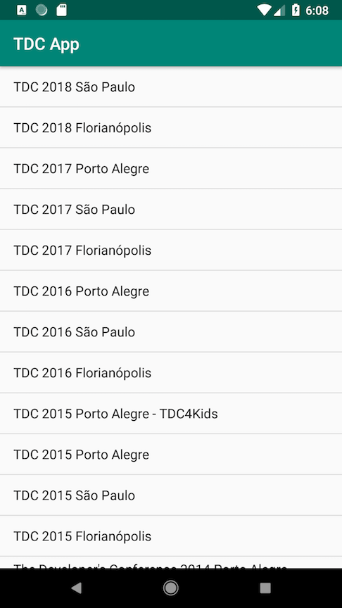
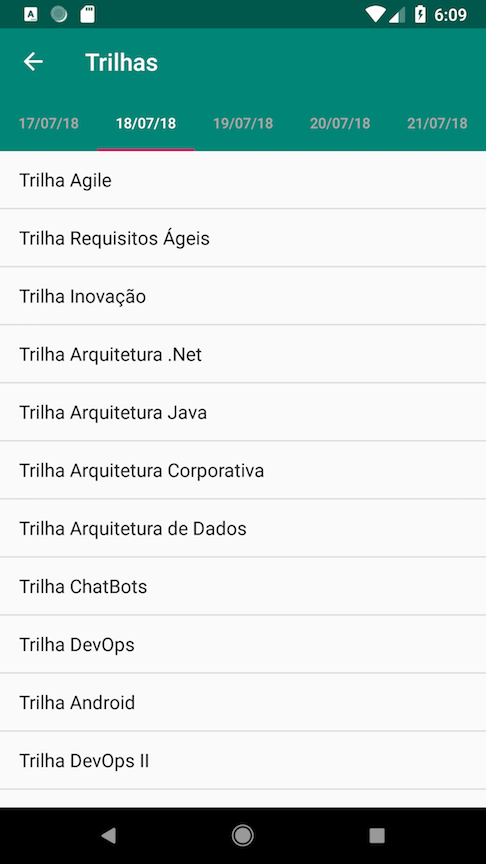
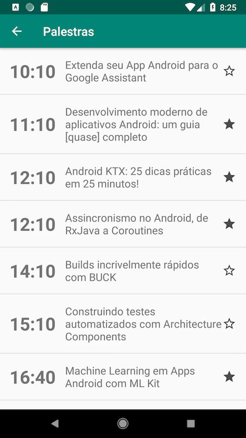
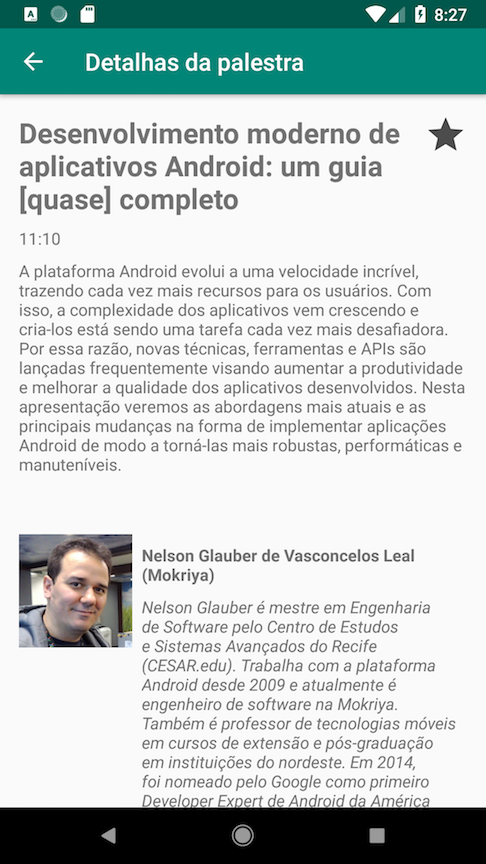

# TDC App
Sample app which access the TDC ([The Developer's Conference](http://www.thedevelopersconference.com.br/tdc/2018/saopaulo/trilhas)) REST API.

In this sample I tried to follow the [Clean Architecture](https://8thlight.com/blog/uncle-bob/2012/08/13/the-clean-architecture.html) principles
and use some cool Android libraries.

## Screenshots
### Events List
This screen lists all events organized by Global Code organized by date and showing the most recent on top.



### Modalities List
The activities (e.g.: sessions, workshops, etc.) that will/were occur in the event are displayed in this screen grouped by date.



### Session List
This screen display the sessions for a given modality sorted by time.



### Session details
Session details are shown in this screen, including the speaker and his mini-bio.



## Libraries
This project is written in Kotlin and it's using the following libraries:
* AppCompat
* Android Architecture Components (View Model and LiveData)
* ConstraintLayout
* [Dagger](https://google.github.io/dagger/)
* Material Design Library
* [Glide](https://github.com/bumptech/glide)
* [Gson](https://github.com/google/gson)
* Javax Inject
* JUnit
* [Mockito](http://site.mockito.org/)
* [OkHttp](http://square.github.io/okhttp/)
* [Retrofit](http://square.github.io/retrofit/)
* [RXJava](https://github.com/ReactiveX/RxJava)

## Get started
This application were created using Android 3.3 Canary 2.
To run this application, you must have a *Client ID* and *Secret* to access the TDC REST API.
To get those information, access the [Global Code](https://www.globalcode.com.br/) web site, create an account and request your credentials.
After that, create the `apikey.properties` file in the root's project directory and put your credentials as below:

```
apiClientId="<YOUR_CLIENT_ID>"
apiSecret="<YOUR_API_SECRET>"
```

And that's it!

## IMPORTANT! Credits!
This sample is based on the sample presented by [Joe Birch](https://joebirch.co/) in [his course](https://caster.io/courses/android-clean-architecture) at [caster.io](https://caster.io/).

Any feedback and/or PR's are appreciated! :)